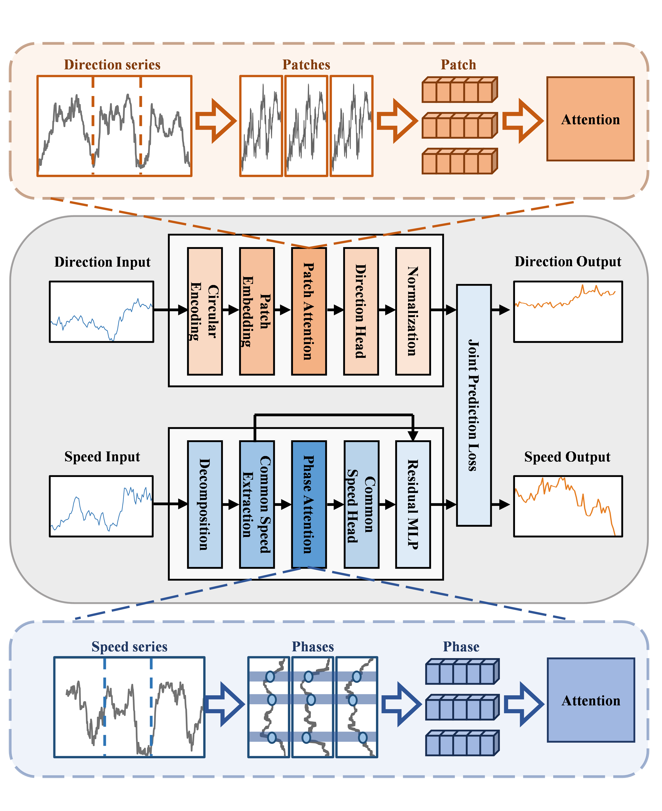
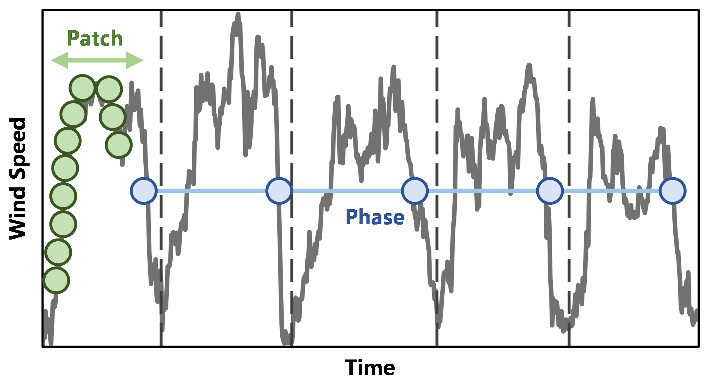
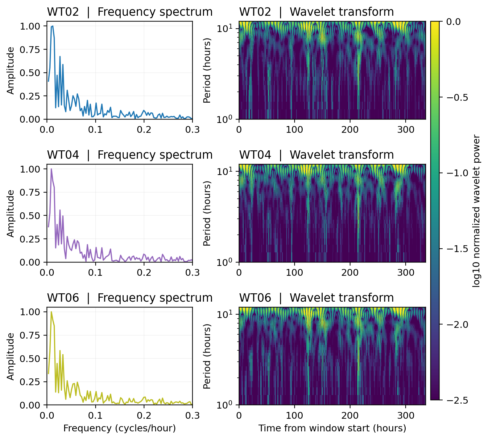

# WindFormer / CSCD-Net 风电预测开源代码

<p align="center">
  
</p>

<p align="center"><em>风速共享动态与风向圆周几何的双分支预测框架。</em></p>

> 论文配套的精简可复现代码包：代码、配置和实验流程随包提供，原始数据
> 通过公开来源获取。

本目录保留山西标准实验、`itransformer` 基线和 `cscd_net` / WindFormer
代码。数据文件已从项目中移除；运行实验前请从原始公开来源下载数据，
并按配置文件放置到对应目录。

## 方法概览

| 分支 | 表示空间 | 核心模块 | 解决的问题 |
| --- | --- | --- | --- |
| 风速 | 公共风场 + 风机残差 | Phase-Attention | 建模跨风机共享演化并恢复局部变化 |
| 风向 | 二维正余弦单位向量 | 共享 Patch-Attention | 保持圆周连续性并保留风机差异 |
| 联合目标 | 风速、方向向量、风矢量一致性损失 | 联合训练 | 协同优化两个物理量而不混淆表示 |

<p align="center">
  
</p>

<p align="center"><em>Phase 表示组织周期位置，Patch 表示保留局部时间片段。</em></p>

<p align="center">
  
</p>

<p align="center"><em>代表性风机的频谱和小波图展示了可利用的共享多尺度结构。</em></p>

## 公开数据集与引用

### Shanxi Wind Turbines Dataset

- GitHub：<https://github.com/lou-yimin/Shanxi-Wind-Turbines-Dataset>
- 本项目使用 24 台风机、10 分钟采样的 Shanxi 数据配置。
- 数据目录：`data/raw/Shanxi/`

请遵守原始仓库的许可证、署名和再分发要求。数据集的机器可读信息见
`data_manifest.yaml`。

### Penmanshiel Wind Farm Dataset

扩展实验使用公开的 Penmanshiel 风电场 SCADA 数据（14 台风机、10 分钟
采样）。原始数据未随本代码发布，请从公开 Zenodo 记录获取，并按照对应
配置文件放置：

- Zenodo：<https://doi.org/10.5281/zenodo.5946808>
- 数据目录：`data/raw/penmanshiel/`

论文中的数据集描述和引用见投稿源文件中的 `references.bib`。

本项目只发布代码、配置和实验流程，不主张拥有上述公开数据集的版权。
使用时请同时引用原始数据集或论文，并保留其原始许可声明。

## 目录结构

```text
code_and_data/
├── assets/                 # README 展示图片
├── configs/final/          # 可复现实验配置
├── scripts/                # 数据准备、训练、评估和基准测试
├── src/wind_repro/         # 数据处理、模型与训练引擎
├── data_manifest.yaml      # 公开数据源与引用信息
├── requirements.txt
└── README.md
```

## 运行

下载并放置数据后：

```powershell
python scripts/prepare_data.py --config configs/final/shanxi_benchmark.yaml
python scripts/benchmark.py --config configs/final/shanxi_benchmark.yaml --models cscd_net itransformer --horizons 6 12 18 --skip-existing
```

或直接运行：

```powershell
.\scripts\run_shanxi_benchmark.ps1
```
